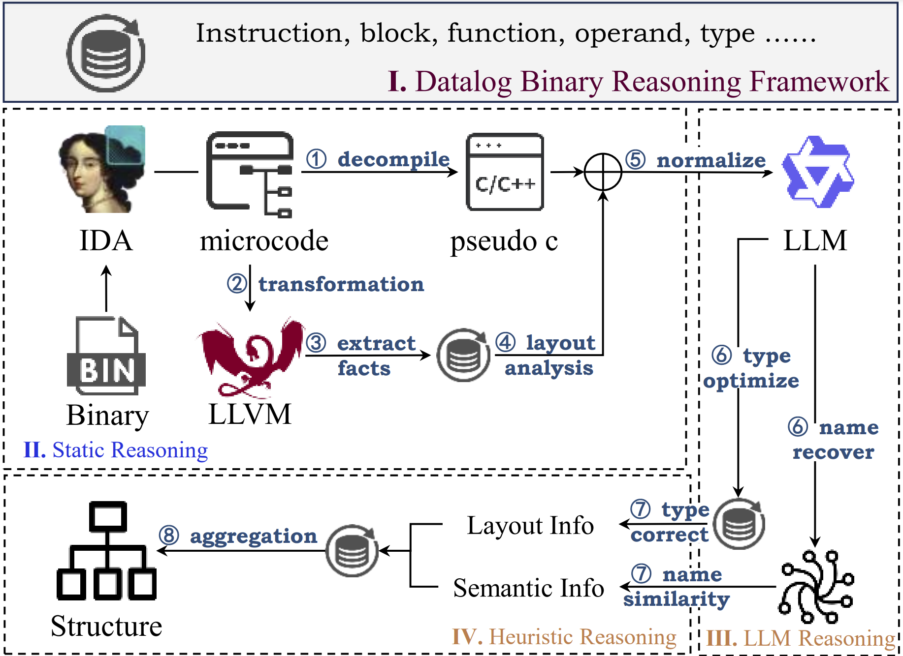

<h1 align="center">HyRES: Recovering Data Structures in Binaries via Semantic-Enhanced Hybrid Reasoning</h1>

<h4 align="center">
<p>
<a href=#about>About</a> |
<a href=#new>New</a> |
<a href=#details>Details</a> |
<a href=#data>Data</a> |
<a href=#acknowledgement>Acknowledgement</a>
<p>
</h4>

## About

HyRES is an innovative hybrid reasoning technique that combines static analysis, large language model (LLM), and heuristic methods to recover data structures from stripped binaries. We present part of code. The full implementation will be public after publication.

 

## News

- [2024/7/10] Paper is ready for review.
- [2024/7/23] Upload part of example rules for heuristic analysis and an exmaple (program cp)

## Details

We present description for each file.

### Label
Extract ground truth from binaries.
```Shell
/path/to/idat64 -A -S"label.py [output]" /path/to/binary
```

### Transformation
Transform LLVM Intermediate Representation into IDA microcode.
```Shell
/path/to/idat64 -A -S"ida2llvm.py [output]" /path/to/binary
```

### Facts
Extract initial facts from LLVM IR for static analysis.
```Shell
cd ./pass && make output

./pass/bin/fact intput.ll ./facts
```

### Static analysis
Datalog rules for static structure analysis.
```Shell
python ./datalog/run.py
```

### Semantics
We use Qwen2 and the following prompt to recover semantics, details in paper.
```
You are a professional reverse engineer, analyze the following C functions: \textcolor{red}{CODE}. If you have better structure filed \textcolor{blue}{(names, types)}, suggest to complete the following JSON dictionary, if not, preserve the original field \textcolor{blue}{(names, types)}. \textcolor{red}{FIELD}. Reply with a JSON dictionary where keys are the original filed names and values are the proposed \textcolor{blue}{(names, types)}. \textcolor{gray}{The field type can only be chosen from "bool, char, word, dword, qword, float, funcptr, structptr and arrayptr"}. Do not explain anything, only print the JSON dictionary.
```

We generate GTE-large for text embedding generation.
```Shell
python encode.py
```
### Aggregation

The following two structures will be identified as the same type due to similar field. And we can recover more structure information by aggregation. Part of heuristic rules show in ./stlog. 
```json
"0x489b_mystruct_1": 
{
"mem_0": ["qword", ["device_id"]], 
"mem_8": ["qword", ["inode_number"]], 
"mem_16": ["qword", ["hard_links"]], 
"mem_24": ["qword", ["file_mode", "permissions"]], 
"mem_32": ["qword", ["user_id"]], 
"mem_40": ["qword", ["group_id"]], 
"mem_48": ["qword", ["device_type"]], 
"mem_56": ["qword", ["file_size"]], 
"mem_64": ["qword", ["block_size"]], 
"mem_72": ["qword", ["access_time_sec"]], 
"mem_80": ["qword", ["access_time_nsec"]], 
"mem_88": ["qword", ["mod_time_sec"]], 
"mem_96": ["qword", ["mod_time_nsec"]], 
"mem_104": ["qword", ["change_time_sec"]], 
"mem_112": ["qword", ["change_time_nsec"]], 
"mem_120": ["qword", ["creation_time_sec"]], 
"mem_128": ["qword", ["creation_time_nsec"]], 
"mem_136": ["qword", ["file_attributes"]], 
"mem_144": ["bool", ["is_changed"]], 
"mem_152": ["qword", ["path_length"]], 
"mem_160": ["ptr", ["next_node"]]
}
```

```json
"0x5c29_mystruct_1": 
{
"mem_0": ["qword", ["unk"]], 
"mem_4": ["dword", ["unk"]], 
"mem_8": ["dword", ["unk"]], 
"mem_12": ["dword", ["unk"]], 
"mem_16": ["dword", ["unk"]], 
"mem_20": ["char", ["unk"]], 
"mem_21": ["char", ["unk"]], 
"mem_22": ["char", ["unk"]], 
"mem_23": ["char", ["unk"]], 
"mem_24": ["char", ["unk"]], 
"mem_25": ["char", ["unk"]], 
"mem_26": ["bool", ["is_root_copy"]], 
"mem_27": ["bool", ["is_root"]], 
"mem_28": ["char", ["unk"]], 
"mem_29": ["char", ["unk"]], 
"mem_30": ["char", ["unk"]], 
"mem_31": ["char", ["unk"]], 
"mem_32": ["char", ["unk"]], 
"mem_33": ["char", ["unk"]], 
"mem_34": ["char", ["unk"]], 
"mem_35": ["char", ["unk"]], 
"mem_36": ["char", ["unk"]], 
"mem_37": ["char", ["unk"]], 
"mem_38": ["char", ["unk"]], 
"mem_39": ["char", ["unk"]], 
"mem_40": ["char", ["unk"]], 
"mem_41": ["char", ["unk"]], 
"mem_42": ["char", ["unk"]], 
"mem_43": ["char", ["unk"]], 
"mem_44": ["char", ["unk"]], 
"mem_45": ["char", ["unk"]], 
"mem_46": ["char", ["unk"]], 
"mem_47": ["char", ["unk"]], 
"mem_48": ["bool", ["posix_flag"]], 
"mem_52": ["dword", ["invalid_flag"]], 
"mem_56": ["dword", ["unk"]], 
"mem_64": ["qword", ["unk"]], 
"mem_72": ["qword", ["unk"]]
}
```


## Data

Vulnerabilities related to structure in ./binaries. The CVE information as follow.

| Vulnerability | Structure Name   | Access Method | Layout    |
| ------------- | ---------------- | ------------- | --------- |
| CVE-2022-1851 | window\_S        | global        | 158 / 162 |
| CVE-2022-0554 | file\_buffer     | indirect      | 147 / 240 |
| CVE-2022-1619 | cmdline\_info\_T | global        | 6 / 14    |
| CVE-2021-3974 | regexec\_T       | global        | 0 / 25    |
| CVE-2021-3984 | pos\_T           | stack         | 3 / 3     |
| CVE-2021-3875 | undoline\_T      | indirect      | 2 / 2     |
| CVE-2022-0407 | block\_def       | indirect      | 14 / 14   |
| CVE-2021-3927 | file\_buffer     | global        | 147 / 240 |
| CVE-2022-0408 | trystate\_T      | indirect      | 20 / 20   |
| CVE-2022-1160 | garray\_T        | stack         | 5 / 5     |
| CVE-2022-1769 | garray\_T        | stack         | 5 / 5     |
| CVE-2022-0213 | window\_S        | indirect      | 158 / 162 |
| CVE-2022-0368 | data\_block      | indirect      | 6 / 6     |
| CVE-2021-4166 | exarg            | indirect      | 24 / 30   |
| CVE-2022-0392 | garray\_T        | stack         | 5 / 5     |
| CVE-2021-3903 | pos\_T           | indirect      | 3 / 3     |
| CVE-2022-0359 | cmdline\_info\_T | global        | 6 / 14    |

Test bench present in ./binaries, including coreutils, grep, gzip, lighttpd and wget.

## Acknowledgement

- [Qwen2](https://github.com/QwenLM/Qwen2): the inference LLM in HyRES that has the amazing language capabilities!
- [GTE](https://huggingface.co/thenlper/gte-large): the encoder for text embeddings generation.
- [vandalir](https://github.com/vandaltool/vandalir): the code base for datalog-based analysis.
